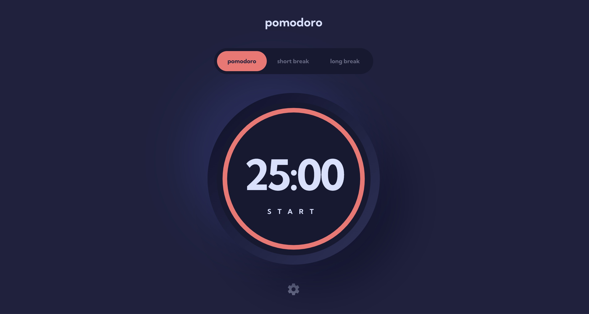

# Frontend Mentor - Pomodoro app solution

This is a solution to the [Pomodoro app challenge on Frontend Mentor](https://www.frontendmentor.io/challenges/pomodoro-app-KBFnycJ6G). Frontend Mentor challenges help you improve your coding skills by building realistic projects.

## Table of contents

- [Overview](#overview)
  - [The challenge](#the-challenge)
  - [Screenshot](#screenshot)
  - [Links](#links)
- [My process](#my-process)
  - [Built with](#built-with)
  - [What I learned](#what-i-learned)
  - [Continued development](#continued-development)
  - [Useful resources](#useful-resources)
- [Author](#author)

## Overview

### The challenge

Users should be able to:

- Set a pomodoro timer and short & long break timers
- Customize how long each timer runs for
- See a circular progress bar that updates every minute and represents how far through their timer they are
- Customize the appearance of the app with the ability to set preferences for colors and fonts

### Screenshot



### Links

- [View code](https://github.com/dominicgerman/pomodoro)
- [View live site](https://pomodoro-dominicgerman.vercel.app/)

## My process

### Built with

- [React](https://reactjs.org/) - JS library
- [TypeScript](https://www.typescriptlang.org/) - JS with types
- [Vite.js](https://vitejs.dev/) - React framework
- [CSS Modules](https://github.com/css-modules/css-modules) - For styles

### What I learned

This was my first time using [Vite](https://vitejs.dev/). All I can say is that I'll never go back to create-react-app. Vite is simple, lightweight, and super user-friendly thanks to their excellent documentation. It's my new go-to solution for bootstrapping a react app when I don't need the advanced features of a framework like Next.

I set out on this project to improve my CSS skills. I hadn't done much with animations or effects before. I learned a lot about using SVGs in React including manipulating the dahsarray property.

These four lines of CSS did most of the heavy lifting for animating the timer countdown ring:

```css
transform: rotate(90deg);
transform-origin: center;
transition: 1s linear all;
transform: scaleX(-1);
```

I found a variety of ways to implement the countdown logic for the timer. I strove for a concise and readable implementation:

```js
useEffect(() => {
  if (isRunning && timeLeft > 0) {
    const tID = setTimeout(() => setTimeLeft(timeLeft - 1), 1000)
    return () => {
      clearTimeout(tID)
    }
  } else if (isRunning && timeLeft === 0) {
    setIsRunning(false)
  }
})
```

I'm falling more and more in love with TypeScript. A few simple lines of code at the top of a component provides type safety and intellisense suggestions when passing props through the component tree:

```js
type Props = {
  timeLeft: number
  timeLimit: number
  handleClick: () => void
  isRunning: boolean
}

function Timer({ timeLeft, timeLimit, handleClick, isRunning }: Props) {
  ...
}
```

### Continued development

- Over the next few days, I'll be adding functionality to change the font and color schemes of the app.
- I would love to add a few unit tests and some integration tests eventually in case I ever want to come back and refactor the code.
- I would love to turn this into a React Native app in the future.

### Useful resources

- [CSS-Tricks](https://css-tricks.com/) - This site helped me write the CSS needed for the animation of the timer countdown ring. Their articles and guides are invaluable and I'll be using them for all my CSS needs going forward.

## Author

- Website - [Dominic German](https://www.dominicgerman.com)
- Frontend Mentor - [@dominicgerman](https://www.frontendmentor.io/profile/dominicgerman)
